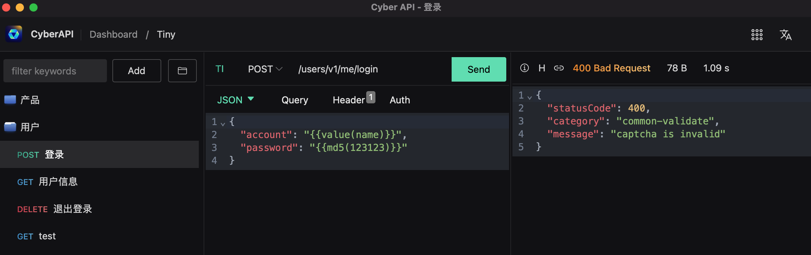
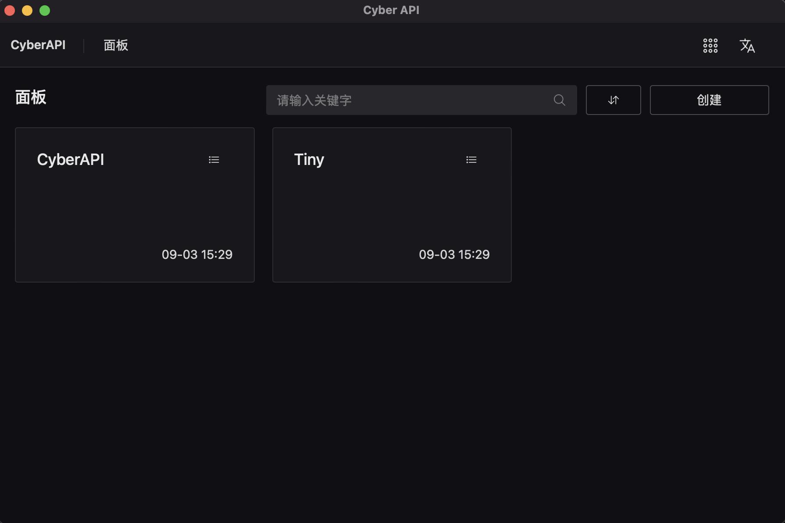
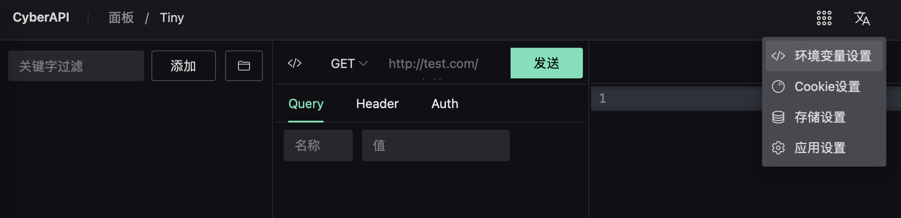
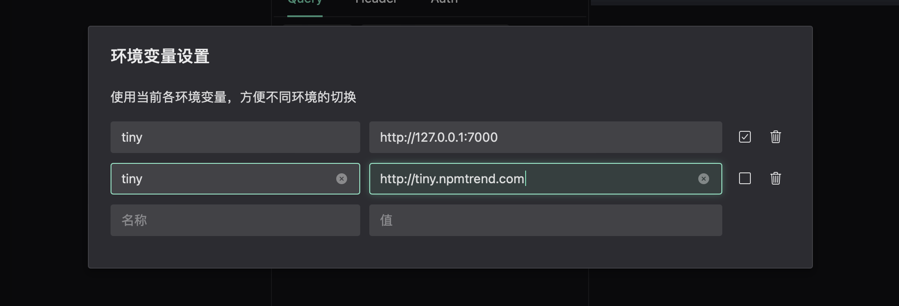
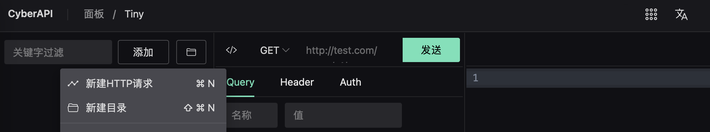
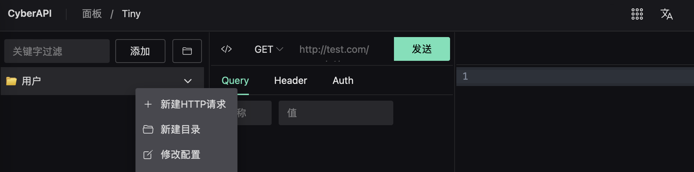
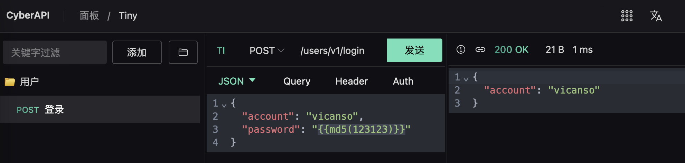
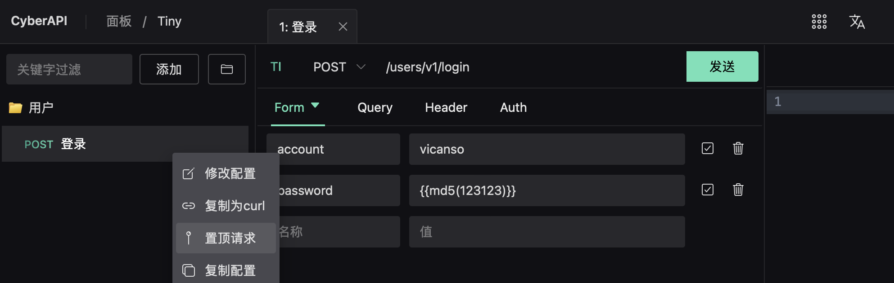
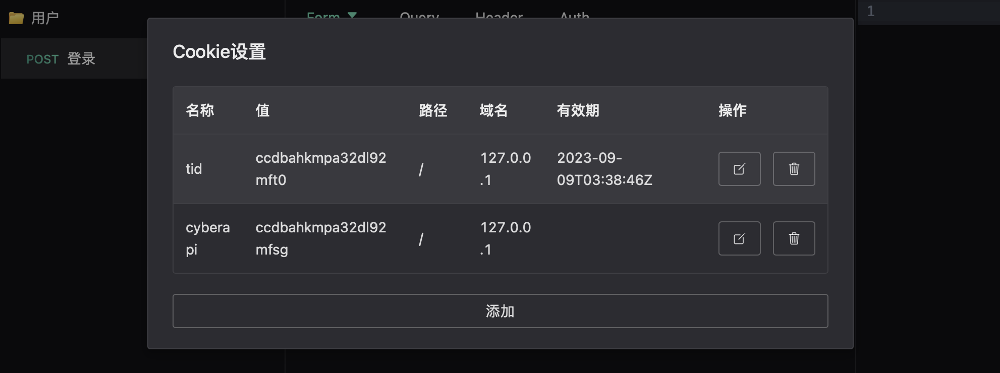
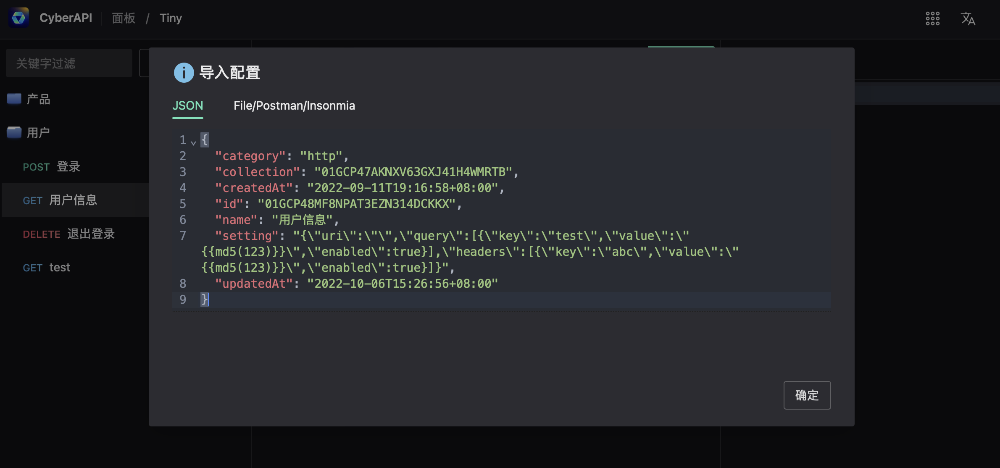

# Cyber API

CyberAPI是基于[tauri](https://github.com/tauri-apps/tauri)开发的跨平台API客户端，用于开发测试HTTP的接口。

    

## 创建项目

首次启动时，需要先创建项目，建议按不同的项目来创建，同一项目可共用环境变量的配置。

    

## 创建项目的环境变量

环境变量主要用于定义HTTP请求的host等场景，用于方便快捷的切换请求对接的环境。

    

tiny配置了两个环境的ENV设置，其中`http://tiny.npmtrend.com`未生效(复选框未勾选)，如果需要切换不同的环境时，选择勾选不同的配置生效即可，需要注意不要同时选择相同的环境变量生效。

    

## 创建目录与请求

创建请求之前，建议按功能来创建不同的分组，例如创建用户相关的一个分组：

    

在创建分组之后，则可以在该分组下创建对应的请求：

    

在创建请求之后，则可以选择请求使用的env(自动添加至请求url中)，对应的HTTP Method以及输入URL。对于POST类请求的body部分，则可以选择对应的数据类型，如选择了json数据，填写对应的参数，图中的`{{md5(123123)}}`为函数形式，会在请求时执行此函数，填充对应的数据，后续会专门介绍此类函数：

    

配置完成后，点击发送则发送该请求，获取到响应后则展示如下图。第一个图标点击时会展示该请求的ID(后续可用于其它请求指定获取该请求的响应时使用)，第二个图标点击会展示此请求对应的`curl`。

    

### 不同的数据类型

数据提交较为常用的是JSON以及Form类型，下图示例为选择Form类型的数据填写（需要注意切换数据类型时会清除原有数据）。如果临时想不使用某个参数，则可取消勾选即可，不需要的则可以删除，参数也可使用函数的形式：

    

`Query`与`Header`的设置与`Form`类似，不再细说。

## Pin

对于经常使用的请求，可以通过`Pin`操作将其置顶，便于后续使用，操作如下：

    

## 内置函数

CyberAPI内置支持了部分函数，便于在请求中动态生成参数值，具体函数如下：

- `readTextFile`：读取文本文件，也可使用简写`rtf`
- `readFile`：读取文件，也可使用简写`rf`
- `base64`：转换为base64，也可使用简写`b64`
- `openFile`：打开文件，弹窗让用户选择要打开的文件，也可使用简写`of`
- `get`：获取请求响应数据的值，也可使用简写`g`
- `timestamp`：时间戳(秒)，也可使用简写`ts`
- `md5`：计算md5并以hex形式输出

### readTextFile

读取文件并以字符的形式返回，其参数为`(file, dir)`，其中`dir`为可选参数，默认为`Download`目录，基于安全考虑，仅允许使用三个目录：`document`，`desktop`以及`download`。例如读取`download`目录下的`test/data.json`，其使用方式：`{{readTextFile(test/data.json, download)}}`

### readFile

读取文件并以字节的形式返回，其参数及使用方法与`readTextFile`一致，仅返回数据的类型不一样

### base64

将字节转换为base64的形式，一般用于函数串联时使用，如读取图片并将其转换为base64，使用方式：`{{base64.readFile(test-files/data.jpg, document)}}`，表示读取图片后，将图片的数据转换为bas64。函数串联可以以多个函数串联使用，处理方式为由右往左，后一个函数参数为前一个函数的返回。

### openFile

弹出文件打开选择框，由客户选择要打开的文件，其返回客户选择的文件路径。

### get

获取指定请求的响应，例如A请求的响应为`{"data": {"name": "CyberAPI"}}`，B请求需要使用A请求的响应的`data.name`，则先获取请求A的ID，在请求A的响应中点图标获取，如下：

    

在得到请求A的ID之后(该ID不会变化)，则使用方式：`{{get(01GCE5X1X5FXM3D13NQQKYEWF7, data.name)}}`，此方式主要用于接口依赖于其它接口的响应的场景中使用。

注：如果响应数据data为数组，从数组中获取第一个元素的值，则参数如下：`data.0.name`

### timestamp

时间戳(秒)，用于返回当前的时间，使用方式：`{{timestamp()}}`

### md5

计算md5并以hex形式输出，使用方式：`{{md5(123123)}}`

## Cookie设置

Cookie的数据为应用共享，在HTTP响应头中有`Set-Cookie`则会自动保存，需要注意对于`Session`有效期的Cookie，在程序关闭之后会自动清除。用户可直接修改Cookie的有效期、值等信息或删除Cookie。

    

## 配置导入

配置导入支持四种方式，`JSON`与`File`仅支持`CyberAPI`的配置形式导入，`PostMan`用于导入postman的配置，`Insonmia`则用于导入insonmia的配置。

    

    

    

