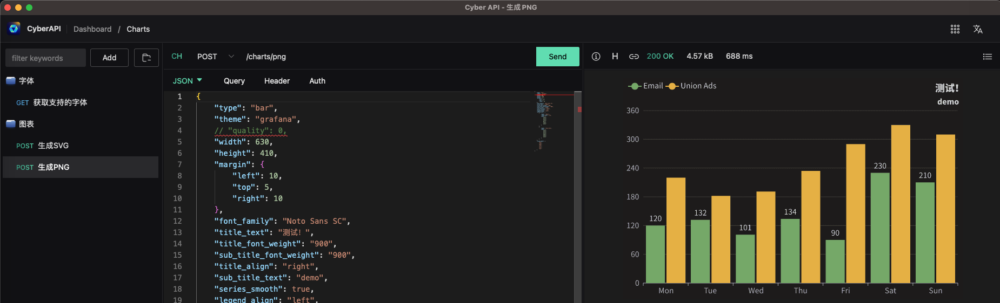

# Cyber API


[](https://github.com/vicanso/cyberapi/actions?query=workflow%3A%22test%22)
[](https://github.com/vicanso/cyberapi)
[](https://cyberapi.app)


<p align="center">
    
</p>

[中文](./README_zh.md)

<h3 align="center">
<a href="https://github.com/vicanso/cyberapi">CyberAPI</a> is API tool based on <a href="https://github.com/tauri-apps/tauri">tauri</a>.
</h3>

## Features

- Support macos, windows and linux platforms, the installation package is below 10MB
- Thousands of interfaces for a single project are opened in seconds, with low memory usage
- Support dark/light theme and chinese/english
- Operation and configuration is simple
- Support importing configuration from postman or insonmia
- The configuration can be exported by interface, function and project, which is convenient for sharing
- Support many custom functions


<p align="center">
    
</p>


## Installation

The installer can be downloaded through [release](https://github.com/vicanso/cyberapi/releases), including windows, macos and linux versions.

Windows may need to install webview2.
## Development


The project depends on rust and Nodejs. If you want to compile or participate in the development yourself, you can first install the dependencies of tauri by referring to the relevant documents [here](https://tauri.app/v1/guides/getting-started/prerequisites), and then :

```shell
yarn
```

Running in browser mode, the data is mock:

```shell
yarn dev
```

Running in app mode:

```shell
make dev
```

Build the release package:

```shell
make build
```


